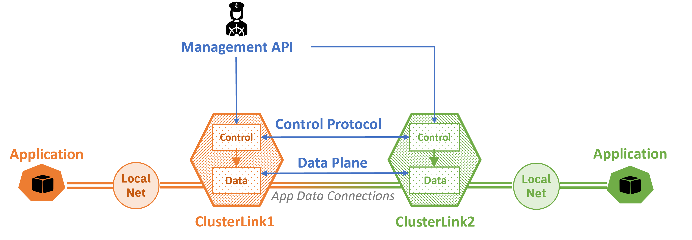

# ClusterLink

ClusterLink simplifies the connection between application services that are
 located in different domains, networks, and cloud infrastructures.

For more details, see our website: [clusterlink.net](https://clusterlink.net/).

## ClusterLink in a nutshell

ClusterLink deploys a gateway into each location, facilitating the configuration and
 access to multi-cloud services.

The ClusterLink gateway contains the following components:

1. ```Control Plane``` is responsible for maintaining the internal state of the gateway,
 for all the communications with the remote peer gateways by means of the ClusterLink CP
 Protocol, and for commanding the local DP to forward user traffic according
 to policies.
 Part of the control plane is the policy engine that can also apply network policies
 (ACL, load-balancing, etc.)
1. ```Data Plane``` responds to user connection requests, both local and remote,
 initiates policy resolution in the CP, and maintains the established connections.
 ClusterLink DP relies upon standard protocols and avoids redundant encapsulations,
 presenting itself as a K8s service inside the cluster and as a regular HTTP endpoint
 from outside the cluster, requiring only a single open port (HTTP/443) and leveraging
 HTTP endpoints for connection multiplexing.



ClusterLink leverages Kubernetes CRDs and the kubectl API to configure cross-cluster communication.
ClusterLink utilizes the following key concepts:

- Peer. Represent remote ClusterLink gateways and contain the metadata necessary for
 creating protected connections to these remote peers.
- Exported service. Represent application services hosted in the local cluster and
 exposed to remote ClusterLink gateways as Imported Service entities in those peers.
- Imported service. Represent remote application services that the gateway makes
 available locally to clients inside its cluster.
- Policy. Represent communication rules that must be enforced for all cross-cluster
 communications at each ClusterLink gateway.

For further information, please refer to the [concepts section](https://clusterlink.net/docs/main/concepts/)) on the ClusterLink website.

## Getting Started

ClusterLink can be set up and run on different environments: local environment (Kind),
 Bare-metal environment, or cloud environment. For more details, refer to the [Getting Started Guide]([docs/installation.md](https://clusterlink.net/docs/main/getting-started/users/)).

Additionally, here are some other documents you may find helpful:

- [Cluster Tutorials](https://clusterlink.net/docs/main/tutorials/) - These tutorials describe how to establish multi-cluster connectivity for applications using two or more clusters.
- [ClusterLink Developer's Guide](https://clusterlink.net/docs/main/getting-started/developers/) -This guide explains how to configure a development environment and contribute code to ClusterLink.

## Contributing

Our project welcomes contributions from any member of our community. To get
 started contributing, please see our [Contributor Guide](CONTRIBUTING.md).

## Scope

### In Scope

ClusterLink is intended to connect services and applications running in different clusters.
 As such, the project will implement or has implemented:

- Remote Service sharing
- Extending private Cloud service endpoints to remote sites
- Centralized management (future)

### Out of Scope

ClusterLink will be used in a cloud native environment with other
 tools. The following specific functionality will therefore not be incorporated:

- Certificate management: ClusterLink uses certificates and trust bundles provided to
 it. It does not manage certificate lifetimes, rotation, etc. - these are delegated to external tools.
- Enabling IP level connectivity between sites. ClusterLink uses existing network paths.
- Pod to Pod communications. ClusterLink works at the level of `Service`s. You can support Pod-to-Pod communications by creating a service per pod.

## Communications

<!-- Fill in the communications channels you actually use.  These should all be public
 channels anyone can join, and there should be several ways that users and contributors
 can reach project maintainers. If you have recurring/regular meetings, list those or a
 link to a publicly-readable calendar so that prospective contributors know when and
 where to engage with you. -->

- [User Mailing List](https://groups.google.com/g/clusterlink-users)
- [Developer Mailing List](https://groups.google.com/g/clusterlink-dev)
<!--
- Slack Channel:
- Public Meeting Schedule and Links:
- Social Media:
- Other Channel(s), If Any:
 -->

<!--
## Resources

[TODO: Add links to other helpful information (roadmap, docs, website, etc.)]
-->

## License

This project is licensed under [Apache License, v2.0](LICENSE).
 Code contributions require [Developer Certificate of Originality](CONTRIBUTING.md#developer-certificate-of-origin).

## Code of Conduct

We follow the [CNCF Code of Conduct](CODE_OF_CONDUCT.md).
