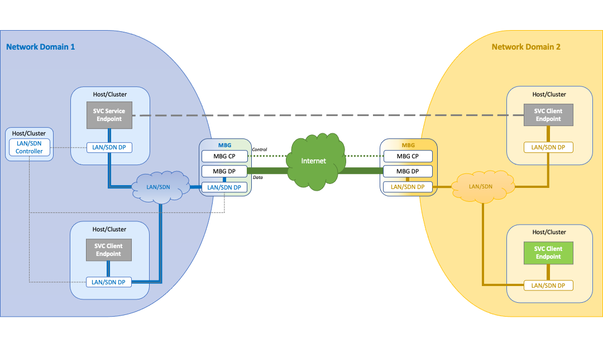

# Multi-cloud Border Gateway(MBG) project  
This project contains all elements for creating and testing a Multi-cloud border gateway. For more details, see the document: 

This project has three main components:  
1) Host - K8s cluster that Contains the service application(e.g., iPerf3) and GO client that communicates with Go MBG
2) MBG - THe Multi-cloud border gateway is a K8s cluster that allows connecting between the host service and destination service and also applies some network functions (TCP-split, etc.)
3) Destination - K8s cluster the contain Service destination (e.g. iperf3 server) 




## <ins>Run MBG in local environment (Kind)<ins>
In this setup the host (iPrf3 client) and destination (iperf3 server) Run in the local machine and MBG run in kind cluster.
1) Set destination server: ```iperf3 -s -p 5003```
2) Build MBG image: ```make docker-build```
3) Run MBG in kind: ```make run-kind-mbg```
4) set the GO client for the host: ``` ./bin/client --listen=127.0.0.1:5001 --mbg=127.0.0.1:30000 -destPort 5003  -destIp <local eth ip> -service "TCP-split"```  
   Note: The local IP can be observed by  ```ip addr``` 
5) Run host service: ```Iperf3 -c 127.0.0.1 -p 5001```

## <ins>Run MBG in Bare-metal environment with 2 hosts<ins> 
Follow instructions from [Here](tests/bare-metal/commands.txt)

## <ins>Run MBG in cloud environment<ins> 
TBD
