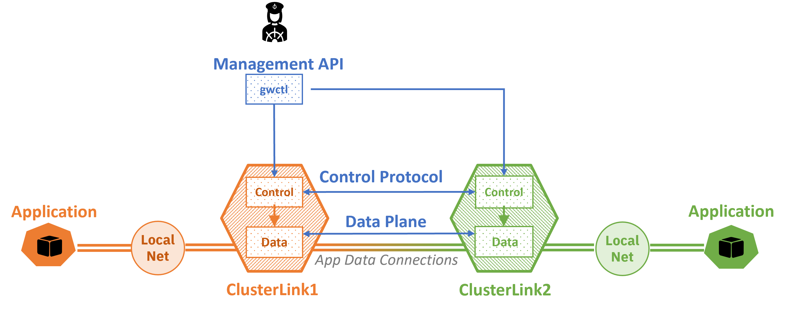

# ClusterLink Project

## Disclaimers and Warnings

This is an incomplete work in progress, provided in the interest of sharing experience
 and gathering feedback.
 The code is pre-alpha quality right now. This means that it shouldn't be used in
 production at all.

Before settling on the `ClusterLink` name. the code base was previously developed as part
 of a "Multi-Border Gateway" concept exploration. You may still find various places in
 code and documentation referring to the old name (directly or using the `MBG` acronym).
 We're in the process of changing all such references.

## What Is ClusterLink?

<!-- Mission Statement -->
<!-- More information about crafting your mission statement with examples -->
<!-- https://contribute.cncf.io/maintainers/governance/charter/ -->

<!-- [TODO: PROJECTNAME] is a [TODO: Type of Tool] that [TODO: Functions it
performs].  [TODO: Reasons why these are needed and valuable].  [TODO:
Implementation, strategy and architecture].

[TODO: Additional paragraph describing your project (optional)] -->

The ClusterLink project simplifies the connection between application services that are
located in different domains, networks, and cloud infrastructures.

For more details, see the document: [ClusterLink extended abstract](docs/ClusteLink.pdf).

ClusterLink deploys a gateway into each location, facilitating the configuration and
access to multi-cloud services.
The ClusterLink gateway contains the following components:

1. ```Control Plane``` is responsible for maintaining the internal state of the gateway,
 for all the communications with the remote peer gateways by means of the ClusterLink CP
 Protocol (REST APIs), and for commanding the local DP to forward user traffic according
 to policies.
 Part of the control plane is the policy engine that can also apply network policies
 (ACL, load-balancing, etc.)
1. ```Data Plane``` responds to user connection requests, both local and remote,
 initiates policy resolution in the CP, and maintains the established connections.
 ClusterLink DP relies upon standard protocols and avoids redundant encapsulations,
 presenting itself as a K8s service inside the cluster and as a regular HTTP endpoint
 from outside the cluster, requiring only a single open port (HTTP/443) and leveraging
 HTTP endpoints for connection multiplexing.
1. ```gwctl``` is CLI implementation that uses REST APIs to send control messages to the
 ClusterLink Gateway.



The ClusterLink APIs use the following entities for configuring cross cluster communication:

- Peer. Represent remote ClusterLink gateways and contain the metadata necessary for
 creating protected connections to these remote peers.
- Exported service. Represent application services hosted in the local cluster and
 exposed to remote ClusterLink gateways as Imported Service entities in those peers.
- Imported service. Represent remote application services that the gateway makes
 available locally to clients inside its cluster.
- Policy. Represent communication rules that must be enforced for all cross-cluster
 communications at each ClusterLink gateway.

## Getting Started

<!-- Include enough details to get started using, or at least building, the
project here and link to other docs with more detail as needed.  Depending on
the nature of the project and its current development status, this might
include:
* quick installation/build instructions
* a few simple examples of use
* basic prerequisites
-->

WIP; combine with sections below. Some details should probably be moved into their own documents.

### How to setup and run ClusterLink

ClusterLink can be set up and run on different environments: local environment (Kind),
Bare-metal environment, or cloud environment.

#### Run ClusterLink in local environment (Kind)

ClusterLink can run in any K8s environment, such as Kind.
To run the ClusterLink in a Kind environment, follow one of the examples:

1. Performance example - Run iPerf3 test between iPerf3 client and server using ClusterLink
 components. This example is used for performance measuring. Instructions can be found
 [Here](demos/iperf3/kind/README.md).
1. Application example - Run the BookInfo application in different clusters using ClusterLink components. This example demonstrates communication distributed applications (in different clusters) with different policies.Instructions can be found [Here](demos/bookinfo/kind/README.md).

#### Run ClusterLink in Bare-metal environment with 2 hosts

TBD

#### Run ClusterLink in cloud environment

TBD

## Contributing
<!-- Template: https://github.com/cncf/project-template/blob/main/CONTRIBUTING.md -->

Our project welcomes contributions from any member of our community. To get
 started contributing, please see our [Contributor Guide](./CONTRIBUTING.md).

## Scope
<!-- If this section is too long, you might consider moving it to a SCOPE.md -->
<!-- More information about creating your scope with links to examples -->
<!-- https://contribute.cncf.io/maintainers/governance/charter/ -->

### In Scope

ClusterLink is intended to [TODO: Core functionality]. As such, the
project will implement or has implemented:

- [TODO: High-level Item 1]
- [TODO: High-level Item 2]
- [TODO: High-level Item 3]

### Out of Scope

ClusterLink will be used in a cloud native environment with other
tools. The following specific functionality will therefore not be incorporated:

- [TODO: Excluded function 1]
- [TODO: Excluded function 2]

ClusterLink implements [TODO: List of major features, existing or planned],
 through [TODO: Implementation requirements/language/architecture/etc.]. It will
 not cover [TODO: short list of excluded items]

## Communications

<!-- Fill in the communications channels you actually use.  These should all be public
 channels anyone can join, and there should be several ways that users and contributors
 can reach project maintainers. If you have recurring/regular meetings, list those or a
 link to a publicly-readable calendar so that prospective contributors know when and 
 where to engage with you. -->

[TODO: Details (with links) to meetings, mailing lists, Slack, and any other communication channels]

- User Mailing List:
- Developer Mailing List:
- Slack Channel:
- Public Meeting Schedule and Links:
- Social Media:
- Other Channel(s), If Any:

## Resources

[TODO: Add links to other helpful information (roadmap, docs, website, etc.)]

## License

<!-- Template: https://github.com/cncf/project-template/blob/main/LICENSE -->
This project is licensed under [TODO: Add name of license and link to your LICENSE file]

## Conduct

<!-- Template: https://github.com/cncf/project-template/blob/main/CODE_OF_CONDUCT.md -->
We follow the CNCF Code of Conduct [TODO: Insert link to your CODE_OF_CONDUCT.md file].
