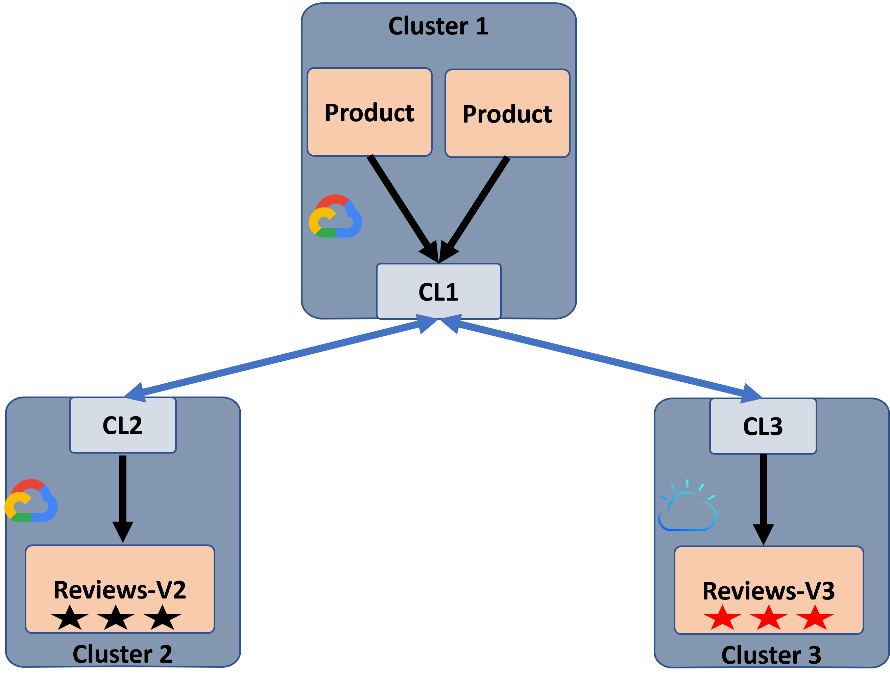

# BookInfo application Test
This demo set [Istio BookInfo application](https://istio.io/latest/docs/examples/bookinfo/) in different clusters.
This demo shows different load-balancing policies like: random, round-robin or static destination more details [policy-engine description](../../../docs/Policy.md).
This test create three kind clusters:
* Two Product-Page microservice (application frontend) and details microservice run on the first cluster.
* The Reviews-V2 (display rating with black stars) and Rating microservices run on the second cluster.
* The Reviews-V3 (display rating with black stars) and Rating microservices run on the third cluster.
System illustration:

## Pre-requires installations
To run a Kind test, check all pre-requires are installed (Go, docker, Kubectl, Kind):

    export PROJECT_FOLDER=`git rev-parse --show-toplevel`
    cd $PROJECT_FOLDER
    make prereqs

## BookInfo test<ins>
Use a single script to build the kind clusters and BookInfo application.

    python3 ./test.py

To run the BookInfo application use a Firefox web browser to connect the ProductPage microservice:

    export GW1IP=`kubectl get nodes -o jsonpath={.items[0].status.addresses[0].address}`
    firefox http://$GW1IP:30001/productpage
    firefox http://$GW1IP:30002/productpage

Note: by default, a random policy is set.

### Apply round-robin load balancing policy.
To apply round-robin load balancing policy to both ProductPage1 and ProductPage2:

    python3 ./apply_lb.py -t round-robin

### Apply static load balancing policy
To apply static policy on ProductPage1 and ProductPage2 that directs them to the same Review service destination:

    python3 ./apply_lb.py -t same

To apply a static policy on ProductPage1 and ProductPage2 that directs them to different Review service destinations:

    python3 ./apply_lb.py -t same

### Clean policy rules
To clean all the policy rules:

    python3 ./apply_lb.py -t clean

### Cleanup
Delete all Kind cluster.

    make clean-kind
