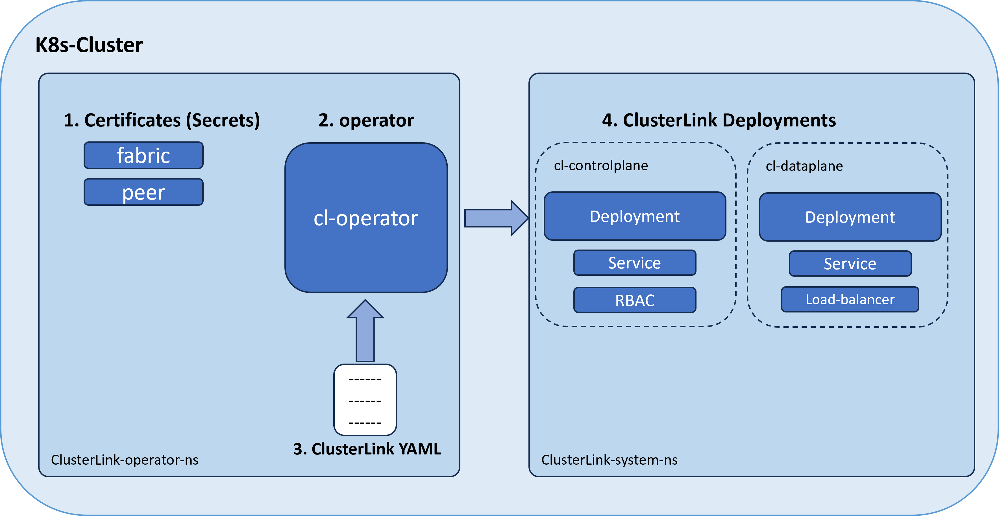

# Design Proposal: Project Deployment

**Authors**: @kfirtoledo 

**Begin Design Discussion**: 2023-11-30

**Status:** draft

## Summary/Abstract

This design proposal outlines the deployment process for the ClusterLink project on a Kubernetes (K8s) cluster.  
The proposal specifically addresses deployment within the K8s environment.   
It will rely on a dedicated K8s operator, to make the deployment more efficient, user-friendly, and native to K8s users.

## Background

### Motivation and problem space

This design proposal aims to simplify and enhance the deployment of the Clusterlink project.
By leveraging K8s deployment standards, such as the K8s operator, the objective is to establish a user-friendly deployment process.

### Impact and desired outcome

Implementing this proposal is expected to improve the accessibility and ease of use for Clusterlink users.   
Aligning the deployment process with K8s standards will particularly benefit use cases involving central control management, such as Multi-Cloud Computing (MCC) or Hybrid Cloud Mesh (HCM).

### Prior discussion and links

Not applicable.

## User/User Story

This is an example to user guide with all the details to install the ClusterLink project on a K8s Cluster.

### Get ClusterLink project
Clone the ClusterLink project:

    git clone git@github.com:clusterlink-net/clusterlink.git

Install the ClusterLink CLI:

    cd clusterlink
    make install

In the future, these two commands should be replaced the command:

    curl -L https://clusterlink.net/install.sh | sh

### Create Fabric certificate
Create the fabric certificate, which is the root CA certificate for all the K8s clusters:

    clusterlink create fabric --name <fabric_name>

The root ca certificates will be saved in the directory ```~/.config/clustrlink/<fabric_name>```.

### Install ClusterLink on K8s Cluster
The easiest way to install ClusterLink on the K8s cluster is by using the command:

    clusterlink install --peer <name>

This command installs the ClusterLink operator and creates the ClusterLink deployment.  
Alternatively you can do it in steps:
First, create and deploy the peer certificate:

    clusterlink create peer --name <name>
    kubectl create -f ```~/.config/clustrlink/<fabric_name>/<peer_nam>/secret.yaml```

Second, create the ClustreLink operator:

    kubectl create -f config/setup/

Then, create clusterlink deployment:
```
kubectl apply -f - <<EOF
apiVersion: clusterlink.net/v1alpha1
kind: ClusterLink
metadata:
  namespace: clusterlink-ns
  name: peer1
spec:
  dataplaneType: "envoy"
  dataplaneReplicates: 1
EOF
```
The operator will create:
* ClusterLink controlplane deployment, including controlplane-pod, controlplane-service, and RBAC roles.  
* ClusterLink dataplane deployment, including dataplane-pod and dataplane-service.
* ClusterLink external access point using load-balancer/node-port/gateway-API service.
  
Overall, the ClusterLink deployment stages are:

    


## Goals
This design document should:

- Define the steps for deploying a ClusterLink gateway to a K8s cluster.
- Define the task functions of the ClusterLink operator.
- Define the CRD (Custom Resource Definition) for the ClusterLink operator.

## Non-Goals
The following aspects are explicitly excluded and are out of scope in the current design:

- This document focuses only on the deployment of ClusterLink to the K8s cluster. 
The deployment to another environment as VMs is out of scope. 
- The security aspects and user permissions concerning the creation of certificates, specifically for fabric or peer.
## Proposal
The ClusterLink deployment will be done in the following steps, (as described in more detail in the User section):

1. Create a Fabric certificate if it does not exist.
2. Create the ClusterLink operator.
3. Deploy the ClusterLink CRD to the operator, which will create peer certificates, ClusterLink deployments (control plane and data plane), services, and external access point.

### ClusterLink CRD
The ClusterLink CRD includes the following fields:
- Api version: clusterlink.net/v1alpha1
- Kind: clusterlink

- **Spec Section:**
  
    | Field name | Description | Default value |
    | ---- | ----- | ------ |
    |dataplaneType| Types of dataplane, supported values "go" or "envoy"|"envoy"|
    |dataplaneReplicates| Number of dataplane replicas|1|
    |logLevel| Log level severity| "info"|
    |logFile| Path to a file where logs will be written| By default logs will be printed to stderr|
    |image| The container registry to pull the project images. If empty, it will use the local registry| ghcr.io/clusterlink-net.
    |serviceExposureType| Type of service to expose ClusterLink deployment, supported values: "load-balancer", "API-gateway", "node-port". |load-balancer|

- **Status section:**

    Todo
## Impacts / Key Questions

- Do we need the ClusterLink CLI? The only command that seems necessary is for fabric and peer certificates.
- We don't use or initialize gwctl anymore.
- Need to have a security discussion focusing on how and who deploys the peer and fabric certificates. 

## Risks and Mitigations

Not applicable.

### Security Considerations

The assumption in this design document is that there isn't a distinction in the security level between creating fabric certificates and peer certificates. Users with permission for one are assumed to have permission for the other.  
Additionally, the Fabric certificate should be accessible to the k8s operator by passing through k8s secrets during the creation of peer certificates.

## Future Milestones
In the first step, the k8s operator will be built and will utilize the current cl-adm implementation to create peer and fabric certificates.  
The `cl-adm create peer1` command will also generate the files: k8s-secret.yaml (containing all the certificates for the control-plane and data-plane) and clusterlink.yaml (containing the manifests for the cl-operator).  
The cl-operator will be deployed manually and will use the clusterlink.yaml to deploy the clusterlink components.

In the second step, the deployment process will be as described in the user section.

## Implementation Details

The k8s operator will be built using the [Kubebuilder](https://kubebuilder.io/) tool, which allows easy building of k8s APIs and operators in Go.

### Testing Plan

Todo

### Update/Rollback Compatibility

Todo
.

### Scalability

Todo

### Implementation Phases/History

Todo
