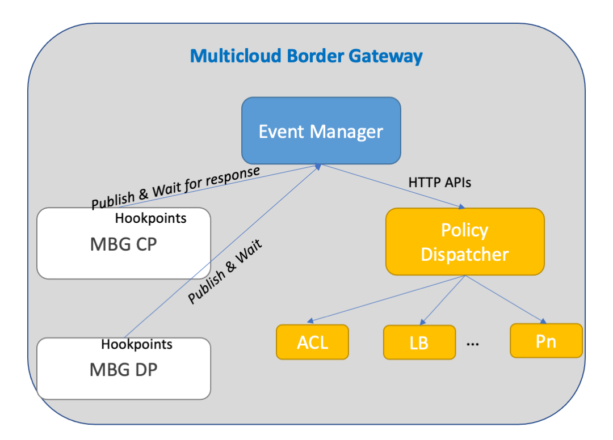

## This Document lays out the design of policy engine of MBG

The MBG's control plane and data plane have hookpoints to publish events to another component called event manager. A hookpoint is be a point in code where *a new connection request has arrived* or *a service listing request arrives*. The event manager receives an event-type, and standard attributes which are associated with the event-type. The event manager then publishes the event to Policy Dispatcher which maintains a list of policy agents (ACL, LB, Limiter, Monitor, etc) which have subscribed to a policy with a certain priority in which they need to executed. For example, *a new connection request* event could be subscribed by ACL, LB and Monitor with a priority of 0, 1 and 2 which means ACL will be the first policy agent and Monitor the last. This also means that Policy Dispatcher maintains the states and handles the stitching of multiple policy agents for an event and handles the movement of shared states between the policy agents.

Policy engine is kept separate to allow extensibility. We could consider dynamically loadable policy agents in javascript web assembly (WASM). However, initially we will start with a set of well known policy agents manually written in golang. The Operator should be able to send commands to the policy dispatcher to program it (add policy, remove policy, subscribe policy event, etc)

### Events + Attributes + Policy Agents Interested + Responses

|   Event        |Attributes                     |Policy Agents                        |Response |
|----------------|-------------------------------|-----------------------------|----------|
|New connection|Src Service, Dst Service, Direction, *Optional Src MBG*         |ACL, LB, Connection Limiter, Rate Limiter, Monitor        | Allow/Deny, Target MBG, Optional Rate-limit  |
|Expose Service          | Service ID        | ACL          | Target MBGs|
|Service List Request          | Src MBG |ACL|Services|

More such events should be added and their attributes clearly attributed, This is just a first step towards that.
