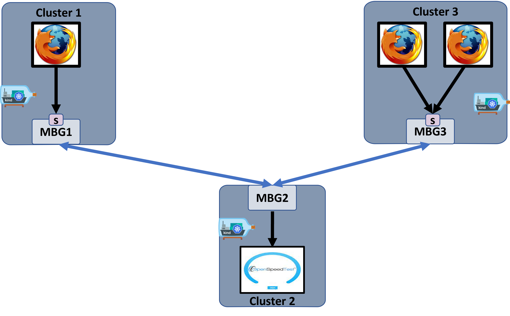

# <ins>OpenSpeedTest application<ins>
In this test we use OpenSpeedTest application for checking connectivity between different kind clusters using the MBG components.  
This setup use three Kind clusters- 
1. MBG1 cluster - contain MBG, mbgctl (MBG control component), and firefox client.
2. MBG2 cluster - contain MBG, mbgctl (MBG control component), and OpenSpeedTest server.
3. MBG3 cluster - contain MBG, mbgctl (MBG control component), and two firefox clients.
     
System illustration:

## <ins> Pre-requires installations <ins>
To run a Kind test, check all pre-requires are installed (Go, docker, Kubectl, Kind):

    export PROJECT_FOLDER=`git rev-parse --show-toplevel`
    cd $PROJECT_FOLDER
    make prereqs

## <ins> OpenSpeedTest test<ins>
Use a single script to build and kind clusters. 

    python3 ./test.py

To run the OpenSpeedTest from MBG1, connect with the web browser to the firefox client.
1. Connect to firefox client :
   
        kubectl config use-context kind-mbg1  
        export MBG1IP=`kubectl get nodes -o jsonpath={.items[0].status.addresses[0].address}`  
        firefox http://$MBG1IP:30000/
2. In the firefox client connect to OpenSpeedTest server:  
   
        http://openspeedtest:3000/ 
3. Run the SpeedTest using the gui

To run the OpenSpeedTest from MBG3, connect with the web browser to the firefox client.
1. Connect to one of the firefox clients :  

        kubectl config use-context kind-mbg3  
        export MBG3IP=`kubectl get nodes -o jsonpath={.items[0].status.addresses[0].address}`  
        firefox http://$MBG3IP:30000/               #First Client
        firefox http://$MBG3IP:30001/               #Second client
2. In the firefox client connect to OpenSpeedTest server:  
   
        http://openspeedtest:3000/ 
3. Run the SpeedTest using the gui

### Apply Policy to Block connection at MBG3
    python3 ./apply_policy.py -m mbg3 -t deny
    python3 ./apply_policy.py -m mbg3 -t show
    
### Apply Policy to Allow connection at MBG3
    python3 ./apply_policy.py -m mbg3 -t allow
    python3 ./apply_policy.py -m mbg3 -t show
    

### Apply Policy to Block connection at MBG2
    python3 ./apply_policy.py -m mbg2 -t deny
    python3 ./apply_policy.py -m mbg2 -t show
    
### Apply Policy to Allow connection at MBG3
    python3 ./apply_policy.py -m mbg2 -t allow
    python3 ./apply_policy.py -m mbg2 -t show
    
### <ins> Cleanup <ins>
Delete all Kind cluster.

    make clean-kind
