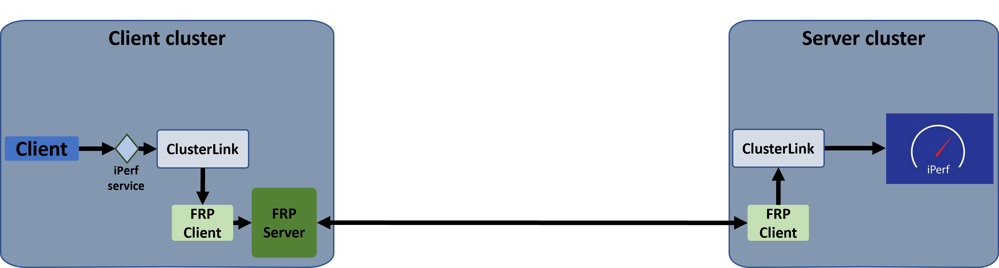

This task involves connecting ClusterLink behind a NAT or firewall.
To connect the ClusterLink gateway, each peer should have a public IP that will be reachable from other peers to enable cross-cluster communications. However, this is not always possible if clusters are behind corporate NAT or firewalls that allow outgoing connections only. In such scenarios, we will use the [Fast Reverse Proxy][] (FRP) open-source project to create reverse tunnels and connect all clusters behind a private network. With FRP, only one IP needs to be public to connect all the clusters in the fabric.

To enable connectivity between the ClusterLink gateways, we need to set up one FRP server with a public IP and create an FRP client for each ClusterLink gateway that connects to the server.

In this task, we will use the FRP Kubernetes image to create the FRP server and clients. We will create one FRP server and two FRP clients: one to create a reverse tunnel and provide access to the server cluster behind a NAT, and another to connect to the FRP server and provide access to the cluster behind the NAT.


<br>
<br>

The FRP server can support multiple clusters behind a private network. However, it is also possible to establish multiple FRP servers, with one for each cluster. If a cluster gateway has a public IP, communication can occur without using FRP.
This task includes instructions on how to connect the peers using FRP. Instructions for creating full connectivity between applications to remote services can be found in the [Nginx tutorial][] and [iPerf3 tutorial][].

In this task, we will extend the peer connectivity instructions to use FRP.

## Create FRP Server

In this step, we will create the FRP server on the same cluster we use for ClusterLink (the `client cluster`), but it can be on any peer or Kubernetes cluster.

1. Create a namespace for all FRP components:

    *Client cluster*:

    ```sh
    echo "
    apiVersion: v1
    kind: Namespace
    metadata:
        name: frp
    " | kubectl apply -f -
    ```

    *Server cluster*:

    ```sh
    echo "
    apiVersion: v1
    kind: Namespace
    metadata:
        name: frp
    " | kubectl apply -f -
    ```

2. Create a configmap that contains the FRP server configuration:

    *Client cluster*:

    ```sh
    echo "
    apiVersion: v1
    kind: ConfigMap
    metadata:
        name: frps-config
        namespace: frp
    data:
        frps.toml: |
            bindPort = 4443
    " | kubectl apply -f -
    ```

    In this setup, we expose the FRP server pod on port `4443`.
3. Create FRP server deployment:

    *Client cluster*:

    ```sh
    echo "
    apiVersion: apps/v1
    kind: Deployment
    metadata:
      name: frps
      namespace: frp
    spec:
      replicas: 1
      selector:
        matchLabels:
          app: frps
      template:
        metadata:
          labels:
            app: frps
        spec:
          hostNetwork: true
          containers:
            - name: frps
              image: snowdreamtech/frps
              volumeMounts:
                - name: frps-config-volume
                  mountPath: /etc/frp/frps.toml
                  subPath: frps.toml
          volumes:
            - name: frps-config-volume
              configMap:
                name: frps-config
          restartPolicy: Always
    " | kubectl apply -f -
    ```

4. Create an ingress service to expose the FRP server:

    *Client cluster*:
v
    ```sh
    echo "
    apiVersion: v1
    kind: Service
    metadata:
        name: clusterlink-frps
        namespace: frp
    spec:
        type: NodePort
        selector:
            app: frps
        ports:
          - port: 4443
            targetPort: 4443
            nodePort: 30444
    " | kubectl apply -f -
    ```

    In this case, we use a `NodePort` service, but it can be other types like `LoadBalancer`.

## Create FRP Clients

1. Set the `FRP_SERVER_IP` and `FRP_SECRET_KEY` variables for each cluster:

    *Client cluster*:

    ```sh
    export FRP_SERVER_IP=`docker inspect -f '{{range .NetworkSettings.Networks}}{{.IPAddress}}{{end}}' client-control-plane`
    export FRP_SECRET_KEY=`echo $USER | sha256sum | head -c 10`
    ```

    *Server cluster*:

    ```sh
    export FRP_SERVER_IP=`docker inspect -f '{{range .NetworkSettings.Networks}}{{.IPAddress}}{{end}}' client-control-plane`
    export FRP_SECRET_KEY=`echo $USER | sha256sum | head -c 10`
    ```

    The `FRP_SECRET_KEY` should be identical across all clusters.

2. Deploy FRP client configuration on each cluster:

    *Client cluster*:

    ```sh
    echo "
    apiVersion: v1
    kind: ConfigMap
    metadata:
        name: frpc-config
        namespace: frp
    data:
        frpc.toml: |
            # Set server address
            serverAddr = \""${FRP_SERVER_IP}"\"
            serverPort = 30444

            [[visitors]]
            name = \"clusterlink-client-to-server-visitor\"
            type = \"stcp\"
            serverName = \"clusterlink-server\"
            secretKey = \""${FRP_SECRET_KEY}"\"
            bindAddr = \"::\"
            bindPort = 6002
    " | kubectl apply -f -
    ```

    *Server cluster*:

    ```sh
    echo "
    apiVersion: v1
    kind: ConfigMap
    metadata:
        name: frpc-config
        namespace: frp
    data:
        frpc.toml: |
            # Set server address
            serverAddr = \""${FRP_SERVER_IP}"\"
            serverPort = 30444

            [[proxies]]
            name = \"clusterlink-server\"
            type = \"stcp\"
            localIP = \"clusterlink.clusterlink-system.svc.cluster.local\"
            localPort = 443
            secretKey = \""${FRP_SECRET_KEY}"\"

    " | kubectl apply -f -
    ```

    For each configuration, we first set the FRP server's IP address and port number.

    In the server cluster, we create a `proxy` that connects to the local ClusterLink gateway and establishes a reverse tunnel to the FRP server, allowing other FRP clients to connect to it.
    In the client cluster, we create an FRP `visitor` that specifies which other peers this client wants to connect to. (You need to create a visitor for each peer you want to connect to.) For more details about FRP configuration, you can refer to the [FRP configuration documentation][]. For an example of connecting multiple clusters behind a private network, see the [ClusterLink FRP example][].

3. Create a K8s service that connects to the FRP client `visitor`, allowing ClusterLink to connect to it:

    *Client cluster*:

    ```sh
    echo '
    apiVersion: v1
    kind: Service
    metadata:
        name: server-peer-clusterlink
        namespace: frp
    spec:
        type: ClusterIP
        selector:
            app: frpc
        ports:
            - port: 6002
              targetPort: 6002
    ' | kubectl apply -f -
     ```

4. Create FRP client deployment for each cluster:

    *Client cluster*:

    ```sh
    echo "
    apiVersion: apps/v1
    kind: Deployment
    metadata:
        name: frpc
        namespace: frp
    spec:
        replicas: 1
        selector:
            matchLabels:
                app: frpc
        template:
            metadata:
                labels:
                    app: frpc
            spec:
                containers:
                    - name: frpc
                      image: snowdreamtech/frpc
                      volumeMounts:
                        - name: frpc-config-volume
                          mountPath: /etc/frp
                volumes:
                  - name: frpc-config-volume
                    configMap:
                        name: frpc-config
                restartPolicy: Always
        " | kubectl apply -f -
    ```

    *Server cluster*:

    ```sh
    echo "
    apiVersion: apps/v1
    kind: Deployment
    metadata:
        name: frpc
        namespace: frp
    spec:
        replicas: 1
        selector:
            matchLabels:
                app: frpc
        template:
            metadata:
                labels:
                    app: frpc
            spec:
                containers:
                    - name: frpc
                      image: snowdreamtech/frpc
                      volumeMounts:
                        - name: frpc-config-volume
                          mountPath: /etc/frp
                volumes:
                  - name: frpc-config-volume
                    configMap:
                        name: frpc-config
                restartPolicy: Always
        " | kubectl apply -f -
    ```

## Create Peer CRD

1. Create a Peer CRD that points to the server cluster. The Peer CRD should connect to a Kubernetes service that points to the `visitor` port in the frpc client.

    *Client cluster*:

    ```sh
    echo "
    apiVersion: clusterlink.net/v1alpha1
    kind: Peer
    metadata:
        name: server
        namespace: clusterlink-system
    spec:
        gateways:
            - host: server-peer-clusterlink.frp.svc.cluster.local
              port: 6002
    " | kubectl apply -f -
    ```

    To verify that the connectivity between the peers is established correctly,
    please check if the condition `PeerReachable` has been added to the peer CR status in each cluster.

    ```sh
    kubectl describe peers.clusterlink.net -A
    ```

    {}

    ```
    Name:         client
    Namespace:    clusterlink-system
    Labels:       <none>
    Annotations:  <none>
    API Version:  clusterlink.net/v1alpha1
    Kind:         Peer
    Metadata:
        Creation Timestamp:  2024-05-28T12:47:33Z
        Generation:          1
        Resource Version:    807
        UID:                 1fdeafff-707a-43e2-bb3a-826f003a42ed
    Spec:
        Gateways:
        Host:  172.18.0.4
        Port:  30443
    Status:
        Conditions:
        Last Transition Time:  2024-05-28T12:47:33Z
        Message:
        Reason:                Heartbeat
        Status:                True
        Type:                  PeerReachable
    ```

    {}

## Connect Application Services

After creating the peer connectivity using FRP, continue to the next step of exporting services, importing services, and creating policies as described in the tutorials [Nginx tutorial][] and [iPerf3 tutorial][].

## Cleanup

To remove all FRP components, delete the `frp` namespace:

*Client cluster*:

```sh
kubectl delete namespace frp
```

*Server cluster*:

```sh
kubectl delete namespace frp
```

This part remove only the FRP components. To remove all ClusterLink components, please refer to the full instructions in the tutorials.

[Nginx tutorial]: 
[iPerf3 tutorial]: 
[Fast Reverse Proxy]: https://github.com/fatedier/frp
[FRP configuration documentation]: https://github.com/fatedier/frp?tab=readme-ov-file#example-usage
[ClusterLink FRP example]: https://github.com/clusterlink-net/clusterlink/tree/main/demos/frp