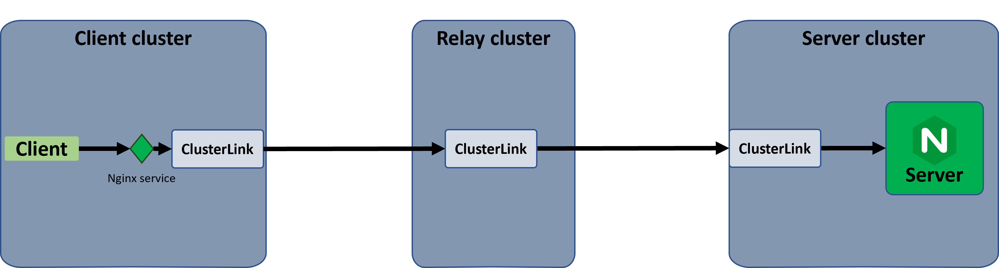

This task involves creating multi-hop connectivity between a client and a server using relay clusters.
Multi-hop connectivity using a relay may be necessary for several reasons, such as:

1. When the client needs to use an indirect connection due to network path limitations.
2. Using multiple relays allows for explicit selection between multiple network paths without impacting or changing the underlying routing information.
3. Using multiple relays provides failover for the network paths.

In this task, we'll establish multi-hop connectivity across clusters using ClusterLink to access a remote nginx server.
In this case, the client will not access the service directly in the server cluster but will pass through a relay cluster.
The example uses three clusters:

1) Client cluster - runs ClusterLink along with a client.
2) Relay cluster  - runs ClusterLink and connects the services between the client and the server.
3) Server cluster - runs ClusterLink along with an nginx server.

System illustration:



## Run basic nginx Tutorial

This is an extension of the basic [nginx toturial][]. Please run it first and set up the nginx server and client cluster.

## Create relay Cluster with ClusterLink

1. Open third terminal for the relay cluster:

    *Relay cluster*:

    ```sh
    cd nginx-tutorial
    kind create cluster --name=relay
    ```

1. Setup `KUBECONFIG` the relay cluster:

    *Relay cluster*:

    ```sh
    kubectl config use-context kind-relay
    cp ~/.kube/config $PWD/config-relay
    export KUBECONFIG=$PWD/config-relay
    ```

1. Create peer certificates for the relay:

    *Relay cluster*:

    ```sh
    clusterlink create peer-cert --name relay
    ```

    
      The relay cluster certificates should use the same Fabric CA files as the server and the client.
    

1. Deploy ClusterLink on the relay cluster:

    *Relay cluster*:

    ```sh
    clusterlink deploy peer --name relay --ingress=NodePort --ingress-port=30443
    ```

## Enable cross-cluster access using the relay

1. Establish connectivity between the relay and the server by adding the server peer, importing the nginx service from the server,
   and adding the allow policy.

    *Relay cluster*:

    ```sh
    export TEST_FILES=https://raw.githubusercontent.com/clusterlink-net/clusterlink/main/demos/nginx/testdata
    export SERVER_IP=`docker inspect -f '{{range .NetworkSettings.Networks}}{{.IPAddress}}{{end}}' server-control-plane`
    curl -s $TEST_FILES/clusterlink/peer-server.yaml | envsubst | kubectl apply -f -
    kubectl apply -f $TEST_FILES/clusterlink/import-nginx.yaml
    kubectl apply -f $TEST_FILES/clusterlink/allow-policy.yaml
    ```

1. Establish connectivity between the relay and the client by adding the relay peer to the client cluster,
   exporting the nginx service in the relay, and importing it into the client.

    *Relay cluster*:

    ```sh
    kubectl apply -f $TEST_FILES/clusterlink/export-nginx.yaml
    ```

    *Client cluster*:

    ```sh
    export TEST_FILES=https://raw.githubusercontent.com/clusterlink-net/clusterlink/main/demos/nginx/testdata
    export RELAY_IP=`docker inspect -f '{{range .NetworkSettings.Networks}}{{.IPAddress}}{{end}}' relay-control-plane`
    curl -s $TEST_FILES/clusterlink/peer-relay.yaml | envsubst | kubectl apply -f -
    kubectl apply -f $TEST_FILES/clusterlink/import-nginx-relay.yaml
    ```

## Test service connectivity

Test the connectivity between the clusters (through the relay) with a batch job of the ```curl``` command:

*Client cluster*:

```sh
kubectl apply -f $TEST_FILES/nginx-relay-job.yaml
```

Verify the job succeeded:

```sh
kubectl logs jobs/curl-nginx-relay-homepage
```

{}

## Cleanup

1. Delete the kind clusters:
    *Client cluster*:

    ```sh
    kind delete cluster --name=client
    ```

    *Server cluster*:

    ```sh
    kind delete cluster --name=server
    ```

    ```sh
    kind delete cluster --name=relay
    ```

1. Remove the tutorial directory:

    ```sh
    cd .. && rm -rf nginx-tutorial
    ```

1. Unset the environment variables:
    *Client cluster*:

    ```sh
    unset KUBECONFIG TEST_FILES
    ```

    *Server cluster*:

    ```sh
    unset KUBECONFIG TEST_FILES
    ```

    *Rekay cluster*:

    ```sh
    unset KUBECONFIG TEST_FILES
    ```

[nginx toturial]: 
