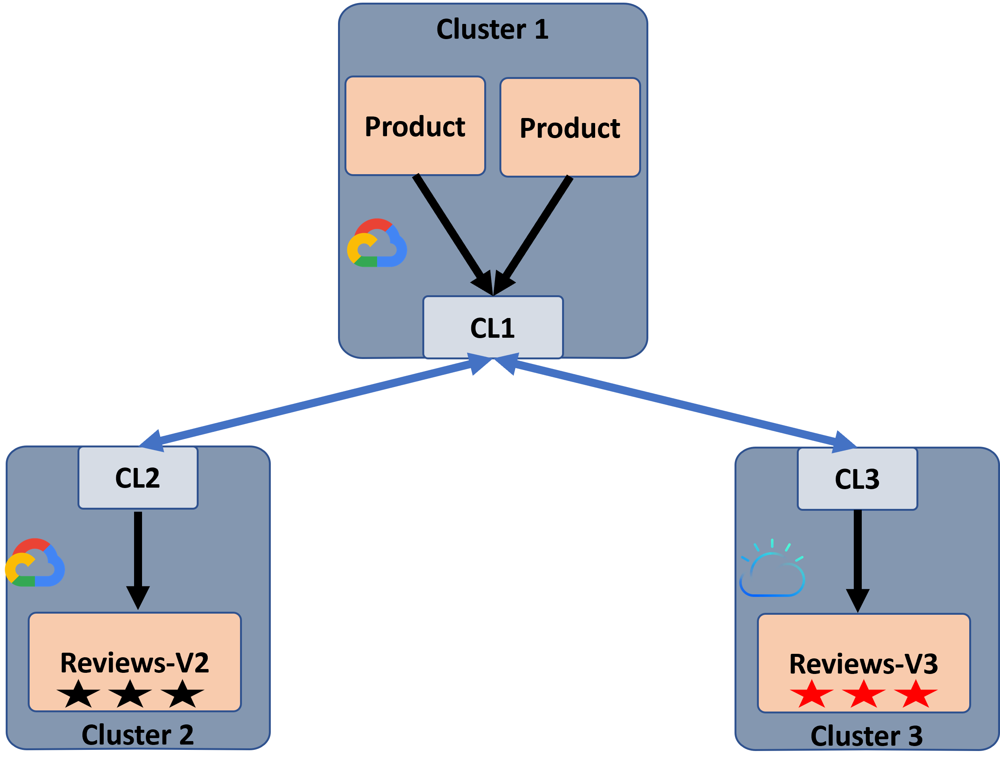

The tutorial sets up the [Istio BookInfo application][] in different clusters.
The tutorial demonstrates the use of AccessPolicy and PrivilegedAccessPolicy custom resources.
The tutorial shows different load-balancing policies like: random, round robin or static destination.
For more details, see the [policies documentation][].
This test creates three kind clusters:

* Two Product Page microservices (application frontend) and a details microservice run on the first cluster.
* The Reviews-V2 (display rating with black stars) and Rating microservices run on the second cluster.
* The Reviews-V3 (display rating with red stars) and Rating microservices run on the third cluster.

System illustration:



## Install ClusterLink CLI

1. Install ClusterLink CLI on Linux or Mac using the installation script:

    ```sh
    curl -L https://github.com/clusterlink-net/clusterlink/releases/latest/download/clusterlink.sh | sh -
    ```

1. Verify the installation:

    ```sh
    clusterlink --version
    ```

## Initialize clusters

In this tutorial we set up a local environment using [kind][].

To setup three kind clusters:

1. Install kind using the [kind installation guide][].
2. Create a directory for all the tutorial files:

    ```sh
    mkdir bookinfo-tutorial && cd bookinfo-tutorial
    ```

3. Create three kind clusters:

    ```sh
    kind create cluster --name=client
    kind create cluster --name=server1
    kind create cluster --name=server2
    ```

   
   kind uses the prefix `kind`, so the name of created clusters will be **kind-client**, **kind-server1**, and **kind-server2**.
   

## Deploy BookInfo application

Install the BookInfo application on the clusters:

```sh
export BOOKINFO_FILES=https://raw.githubusercontent.com/clusterlink-net/clusterlink/main/demos/bookinfo/manifests
kubectl config use-context kind-client
kubectl apply -f $BOOKINFO_FILES/product/product.yaml
kubectl apply -f $BOOKINFO_FILES/product/product2.yaml
kubectl apply -f $BOOKINFO_FILES/product/details.yaml

kubectl config use-context kind-server1
kubectl apply -f $BOOKINFO_FILES/review/review-v2.yaml
kubectl apply -f $BOOKINFO_FILES/review/rating.yaml

kubectl config use-context kind-server2
kubectl apply -f $BOOKINFO_FILES/review/review-v3.yaml
kubectl apply -f $BOOKINFO_FILES/review/rating.yaml

```

## Deploy ClusterLink

1. Create the fabric and peer certificates and deploy ClusterLink to the clusters:

    *Client cluster*:

    ```sh
    clusterlink create fabric

    kubectl config use-context kind-client
    clusterlink create peer-cert --name client
    clusterlink deploy peer --name client --ingress=NodePort --ingress-port=30443

    kubectl config use-context kind-server1
    clusterlink create peer-cert --name server1
    clusterlink deploy peer --name server1 --ingress=NodePort --ingress-port=30443

    kubectl config use-context kind-server2
    clusterlink create peer-cert --name server2
    clusterlink deploy peer --name server2 --ingress=NodePort --ingress-port=30443
    ```

   
   This tutorial uses NodePort to create an external access point for the kind clusters.
    By default `deploy peer` creates an ingress of type LoadBalancer,
    which is more suitable for Kubernetes clusters running in the cloud.
   

2. Verify that the ClusterLink control and data plane components are running:

   It may take a few seconds for the deployments to be successfully created.

   ```sh
   kubectl rollout status deployment cl-controlplane -n clusterlink-system
   kubectl rollout status deployment cl-dataplane -n clusterlink-system
   ```

   {}

   ```sh
   deployment "cl-controlplane" successfully rolled out
   deployment "cl-dataplane" successfully rolled out
   ```

   {}

## Enable cross-cluster access

In this step, we enable connectivity access for the BookInfo application
 by connecting the ProductPage service (client) to the reviews-v2 service (server1)
 and reviews-v3 (server2). We establish connections between the peers, export the reviews service on the server side,
 import the reviews service on the client side, and create a policy to allow the connection.

Note that the provided YAML configuration files refer to environment variables
 (defined below) that should be set when running the tutorial. The values are
 replaced in the YAMLs using `envsubst` utility.

{}
In case `envsubst` does not exist, you can install it with:

```sh
brew install gettext
brew link --force gettext
```

{}

  ```sh
  kubectl config use-context kind-client
  export SERVER1_IP=`docker inspect -f '{{range .NetworkSettings.Networks}}{{.IPAddress}}{{end}}' server1-control-plane`
  curl -s $BOOKINFO_FILES/clusterlink/peer-server1.yaml | envsubst | kubectl apply -f -
  export SERVER2_IP=`docker inspect -f '{{range .NetworkSettings.Networks}}{{.IPAddress}}{{end}}' server2-control-plane`
  curl -s $BOOKINFO_FILES/clusterlink/peer-server2.yaml | envsubst | kubectl apply -f -
  kubectl apply -f $BOOKINFO_FILES/clusterlink/import-reviews.yaml
  kubectl apply -f $BOOKINFO_FILES/clusterlink/allow-policy.yaml

  kubectl config use-context kind-server1
  export CLIENT_IP=`docker inspect -f '{{range .NetworkSettings.Networks}}{{.IPAddress}}{{end}}' client-control-plane`
  curl -s $BOOKINFO_FILES/clusterlink/peer-client.yaml | envsubst | kubectl apply -f -
  kubectl apply -f $BOOKINFO_FILES/clusterlink/export-reviews.yaml
  kubectl apply -f $BOOKINFO_FILES/clusterlink/allow-policy.yaml

  kubectl config use-context kind-server2
  export CLIENT_IP=`docker inspect -f '{{range .NetworkSettings.Networks}}{{.IPAddress}}{{end}}' client-control-plane`
  curl -s $BOOKINFO_FILES/clusterlink/peer-client.yaml | envsubst | kubectl apply -f -
  kubectl apply -f $BOOKINFO_FILES/clusterlink/export-reviews.yaml
  kubectl apply -f $BOOKINFO_FILES/clusterlink/allow-policy.yaml
  ```

## BookInfo test

To run the BookInfo application use a Firefox web browser to connect the ProductPage microservice:

  ```sh
  kubectl config use-context kind-client
  firefox http://$CLIENT_IP:30001/productpage
  firefox http://$CLIENT_IP:30002/productpage
  ```


By default, a round-robin policy is set.


## Apply privileged access policy

In the previous steps, an unprivileged access policy was set to allow connectivity.
To enforce high-priority policy use the `PrivilegedAccessPolicy` CRD.
In this example, we enforce that the ProductPage service can access only reviews-v3 from server2,
and deny all services from server1:


{}

```sh
kubectl config use-context kind-client
kubectl apply -f $BOOKINFO_FILES/clusterlink/deny-server1-policy.yaml
```

{}
{}

```sh
echo "
apiVersion: clusterlink.net/v1alpha1
kind: PrivilegedAccessPolicy
metadata:
  name: deny-from-server1
spec:
  action: deny
  from:
    - workloadSelector: {}
  to:
    - workloadSelector: {
      matchLabels: {
                    clusterlink/metadata.gatewayName: server1
                }
    }
" | kubectl apply -f -
```

{}


To remove the privileged access policy use the following command:


{}

```sh
kubectl delete -f $BOOKINFO_FILES/clusterlink/deny-server1-policy.yaml
```

{}
{}

```sh
echo "
apiVersion: clusterlink.net/v1alpha1
kind: PrivilegedAccessPolicy
metadata:
  name: deny-from-server1
spec:
  action: deny
  from:
    - workloadSelector: {}
  to:
    - workloadSelector: {
      matchLabels: {
                    clusterlink/metadata.gatewayName: server1
                }
    }
" | kubectl delete -f -
```

{}


For more details regarding policy configuration, see [policies documentation][].

## Apply random load-balancing policy

To apply a random load-balancing policy on connection to reviews import:


{}

```sh
kubectl config use-context kind-client
kubectl apply -f $BOOKINFO_FILES/clusterlink/import-reviews-lb-random.yaml
```

{}
{}

```sh
echo "
apiVersion: clusterlink.net/v1alpha1
kind: Import
metadata:
  name: reviews
  namespace: default
spec:
  port:       9080
  sources:
    - exportName:       reviews
      exportNamespace:  default
      peer:             server1
    - exportName:       reviews
      exportNamespace:  default
      peer:             server2
  lbScheme: random

" | kubectl apply -f -
```

{}


## Apply static load balancing policy

To apply a static policy that selects the first peer in the sources array and uses the other peer for failover cases,
 use the following:


{}

```sh
kubectl config use-context kind-client
kubectl apply -f $BOOKINFO_FILES/clusterlink/import-reviews-lb-static.yaml
```

{}
{}

```sh
echo "
apiVersion: clusterlink.net/v1alpha1
kind: Import
metadata:
  name: reviews
  namespace: default
spec:
  port:       9080
  sources:
    - exportName:       reviews
      exportNamespace:  default
      peer:             server1
    - exportName:       reviews
      exportNamespace:  default
      peer:             server2
  lbScheme: static

" | kubectl apply -f -

{}


## Apply round-robin load-balancing policy

To apply a round-robin load-balancing policy (which is used by default) to the connection to reviews import:


{}

```sh
kubectl config use-context kind-client
kubectl apply -f $BOOKINFO_FILES/clusterlink/import-reviews.yaml
```

{}
{}

```sh
echo "
apiVersion: clusterlink.net/v1alpha1
kind: Import
metadata:
  name: reviews
  namespace: default
spec:
  port:       9080
  sources:
    - exportName:       reviews
      exportNamespace:  default
      peer:             server1
    - exportName:       reviews
      exportNamespace:  default
      peer:             server2
  lbScheme: round-robin

" | kubectl apply -f -
```

{}


## Cleanup

1. Delete the `kind` clusters:

    ```sh
    kind delete cluster --name=client
    kind delete cluster --name=server1
    kind delete cluster --name=server2
    ```

2. Remove the tutorial directory:

    ```sh
    cd .. && rm -rf bookinfo-tutorial
    ```

3. Unset the environment variables:

    ```sh
    unset BOOKINFO_FILES CLIENT_IP SERVER1_IP SERVER2_IP
    ```

<!-- Links list -->
[Istio BookInfo application]: https://istio.io/latest/docs/examples/bookinfo/
[policies documentation]: 
[kind installation guide]: https://kind.sigs.k8s.io/docs/user/quick-start
[kind]: https://kind.sigs.k8s.io/
